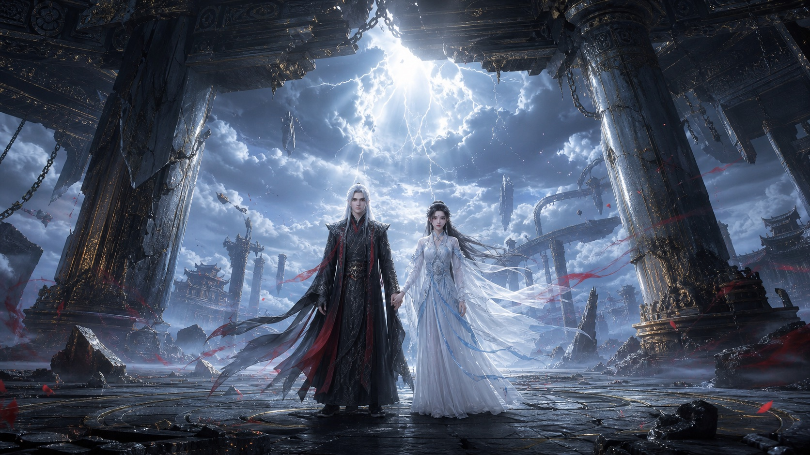
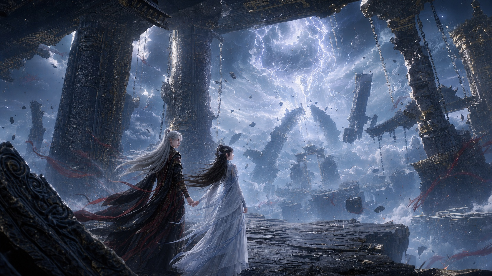
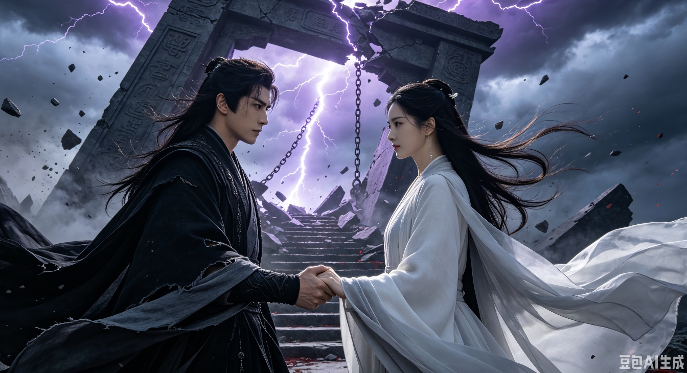

# guofeng-director

[中文文档](README.md) | English

`guofeng-director` is an AI Agent Skill for directing Chinese guofeng donghua image prompts. It produces structured, auditable, copy-ready prompts for character-forward ancient Chinese fantasy visuals.

It is designed for guofeng donghua visual creation, with emphasis on clear characters, stable reference-image identity, reliable two-person interaction, explicit style routing, and auditable prompt structure.

## Positioning

This Skill supports three visual routes:

- `逆仙黑暗`: cold, lonely, oppressive dark xianxia with high contrast, calamity, ruined heavenly gates, and giant-scale pressure.
- `斗破热血`: youthful action, flame energy, explosive combat, breakthrough moments, and hot-blooded poster composition.
- `古风国漫通用`: elegant guofeng fantasy, clear emotional portraits, luminous atmosphere, and cinematic ancient-style scenes.

## Core Features

- Expands short ideas into complete guofeng donghua prompts.
- Supports dark xianxia, flame-action, and general guofeng style routes.
- Prioritizes clear frontal faces, readable expressions, coherent hands, and structured costumes.
- Supports reference-image-based character consistency.
- Supports two-person interactions such as hand-holding, eye contact, protection, side-by-side poses, and confrontation.
- Uses `人物优先级：高 / 中 / 低` to control character scale, instead of always making people tiny environmental markers.
- Produces structured outputs for easy auditing and reuse.
- Works with Codex, Claude, Grok, Kimi, MiniMax, Seedance, Workbuddy, Catpaw, and similar platforms.

## Design

This project uses a rule-driven visual direction workflow:

- Conditional reference loading.
- Parameter lock.
- Route-based rule inheritance.
- Structured output.
- Final audit before response.

Core design priorities:

- Character clarity is promoted to a master rule.
- Front-facing or three-quarter front faces are the default for high-priority people.
- Reference-image consistency has dedicated rules.
- Two-person interaction is treated as a first-class composition type.
- Character scale is controlled by `人物优先级`.
- `SYSTEM_PROMPT.md` can be copied directly into non-Skill platforms.

## Demo Images

`逆仙黑暗` (dark xianxia) route examples: clear frontal faces, stable hand-holding interaction, a collapsing giant heavenly gate under thunder calamity, cold blue-gray palette with a small blood-red accent.





The image below was generated end-to-end in Doubao via the [Director + Renderer workflow](#generation-workflow-director--renderer) (the "豆包AI生成" mark is Doubao's own watermark):



> `斗破热血` and `古风国漫通用` route examples will be added later.

## Layout

```text
guofeng-director/
├── README.md
├── README.en.md
├── SKILL.md
├── SYSTEM_PROMPT.md
├── assets/
│   └── demo/
├── agents/
│   └── openai.yaml
├── scripts/
│   └── check-sync.sh
└── references/
    ├── master-rules.md
    ├── style-routes.md
    ├── character-rules.md
    ├── composition-light.md
    └── negative.md
```

## Usage In Codex

Place this folder where Codex can load Skills, then invoke it explicitly:

```text
使用 $guofeng-director
风格路由：逆仙黑暗
人物优先级：高
画幅比例：16:9
参考图：使用我提供的两张角色图

王林与李慕婉正面牵手，站在崩塌的巨型天门前，两人面向镜头，背景是被雷劫撕裂的苍穹。
```

## Usage On Other Models

For Kimi, MiniMax, Seedance, Workbuddy, Catpaw, Grok, and similar platforms, copy the full content of [SYSTEM_PROMPT.md](SYSTEM_PROMPT.md) into the model's system prompt, custom instruction, or agent role prompt.

Example request:

```text
风格路由：斗破热血
人物优先级：高
画幅比例：4:5
人物：一名黑衣少年，正面半身，右手托起青蓝异火
场景：远处沙漠城墙被火浪照亮
输出：标准结构化提示词
```

## Generation Workflow: Director + Renderer

This Skill is the **director** — it turns an idea into a structured prompt. Producing the actual picture is the **renderer's** job. Platforms fall into two groups:

- **Conversational platforms (LLM / Agent)**: Claude, Codex, Doubao, Grok, Kimi, Tongyi Qianwen, etc. — can load this Skill as the director and output prompts.
- **Image models (renderer)**: Jimeng, Tongyi Wanxiang, Midjourney, Stable Diffusion, etc. — only render a prompt into an image.
- **Doubao and Grok do both**, so a single conversation can direct and render in one step.

### One-step generation in Doubao (recommended)

1. Open Doubao (Mac / mobile app, or `doubao.com`) and start a new conversation.
2. First message: paste the full [SYSTEM_PROMPT.md](SYSTEM_PROMPT.md). It affects only this conversation and nothing else; for long-term reuse, create a custom bot and set this content as its persona so you never re-paste it.
3. Second message: describe the scene in the parameter format, e.g.:

```text
风格路由：逆仙黑暗
人物优先级：高
画幅比例：16:9
人物：黑衣男 + 白衣女，正面牵手
场景：崩塌的巨型天门前，雷劫撕裂苍穹
```

4. After Doubao returns the complete prompt and negative constraints, send: `根据完整提示词直接生成图片` (generate the image directly from the complete prompt).
5. Keep refining in natural language: `换竖版` (vertical), `脸再清晰一点` (clearer face), `换一个机位` (new camera angle).

> For renderer-only platforms (Jimeng / Tongyi Wanxiang / MJ / SD): paste the complete prompt into the positive field and the negative constraints into the negative field; on platforms without a negative field, append the negatives as an `avoid: ...` line after the positive prompt.

## Standard Output

The Skill normally returns:

1. `参数锁定`
2. `视觉导演方案`
3. `完整提示词`
4. `负面约束`
5. `可衍生方向`

Use `只要提示词` for a shorter response containing only the complete prompt and negative constraints.

## Maintenance: rule source of truth

The rules live on two surfaces that must not drift apart:

- `references/*.md` — the **source of truth** (detailed, English), loaded by the Skill on demand per `SKILL.md`.
- [SYSTEM_PROMPT.md](SYSTEM_PROMPT.md) — a **derived, condensed Chinese port** for platforms that cannot load files.

When you change a rule, update `references/` first, then reflect it in `SYSTEM_PROMPT.md`. The negative-constraint blocks are language-neutral and must stay byte-identical across both files. Run the drift checker before committing:

```bash
scripts/check-sync.sh
```

## License

This project is released under the MIT License. See [LICENSE](LICENSE).

The repository intentionally contains only the Skill instructions and metadata needed for reuse. Local runtime files, generated outputs, caches, logs, and secrets are excluded by [.gitignore](.gitignore).
