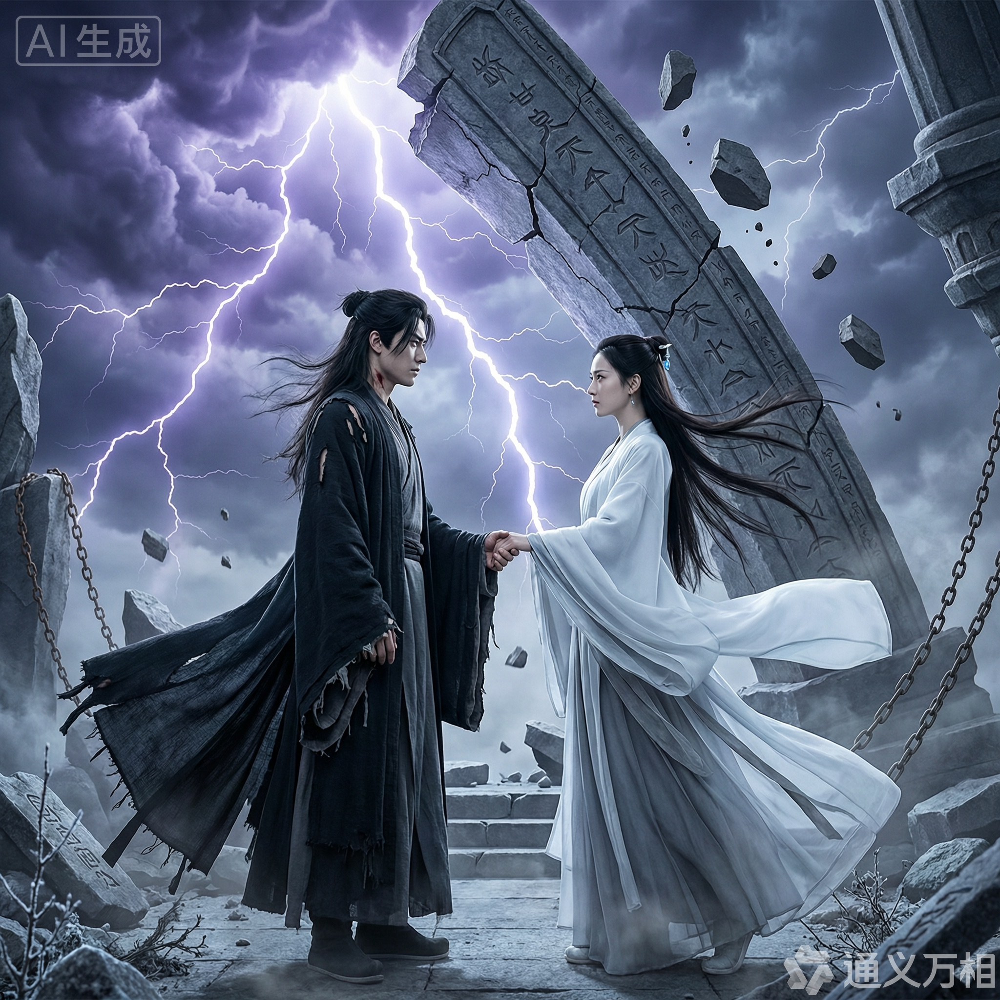
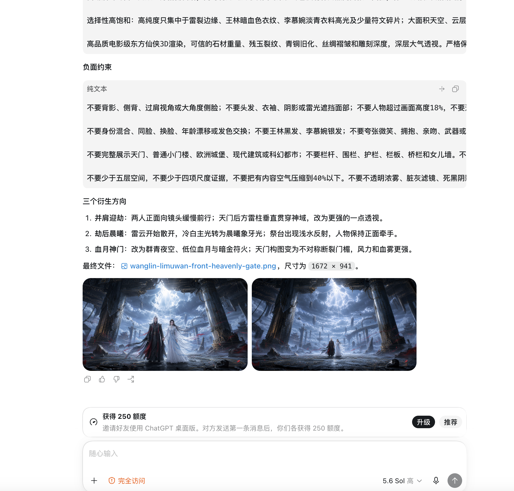

# guofeng-director

中文文档 | [English](README.en.md)

`guofeng-director` 是一套「古风国漫视觉导演」AI Agent Skill，用于生成结构化、可审计、可直接复制使用的图像提示词。

它面向古风国漫画面创作，重点解决角色清晰、参考图一致、双人互动稳定、风格路由明确和提示词结构可审计的问题。

## 项目定位

本 Skill 重点支持三条视觉路线：

- `逆仙黑暗`: 冷峻、孤独、压抑、高对比、巨物压迫、天劫、崩塌天门。
- `斗破热血`: 少年感、火焰、异火、能量爆发、战斗海报、成长突破。
- `古风国漫通用`: 清丽、仙气、电影感、通透光影、情绪表达、古风角色与场景。

## 核心能力

- 从简短想法扩展为完整古风国漫提示词。
- 支持 `逆仙黑暗` / `斗破热血` / `古风国漫通用` 风格路由。
- 强调人物正面清晰、表情可读、手部和服饰结构稳定。
- 支持参考图驱动的角色一致性。
- 支持双人互动，例如牵手、对视、护持、并肩、对峙。
- 使用 `人物优先级：高 / 中 / 低` 控制角色占比，不再默认把人物压成极小尺度点缀。
- 输出结构固定，便于审计和复用。
- 兼容 Codex、Claude、Grok、Kimi、MiniMax、Seedance、Workbuddy、Catpaw 等平台。

## 设计特点

本项目采用规则驱动的视觉导演流程：

- 按需加载 references（Conditional reference loading）。
- Parameter lock。
- Route-based rule inheritance。
- Structured output。
- Final audit before response。

核心设计重点：

- 将“人物清晰度”提升为共享总则。
- 正面或三分之二正面人物成为高优先级角色的默认方向。
- 参考图一致性拥有独立规则。
- 双人互动成为一等构图类型。
- 人物占比由 `人物优先级` 控制，而不是固定作为环境尺度点。
- 新增 `SYSTEM_PROMPT.md`，可直接复制给国内模型和 Grok 使用。

## 演示图

以下为 `逆仙黑暗` 路由示例：双人正面清晰、牵手互动稳定、崩塌巨型天门与雷劫压迫，冷蓝灰主色配少量血红点睛。


以下为按「[生图工作流：导演 + 画师](#生图工作流导演--画师)」在不同平台实测生成的成品（图中水印为各平台自带）：




> `斗破热血` 与 `古风国漫通用` 路由的示例图后续补充。

## 目录结构

```text
guofeng-director/
├── README.md
├── README.en.md
├── SKILL.md
├── SYSTEM_PROMPT.md
├── assets/
│   └── demo/
├── agents/
│   └── openai.yaml
├── scripts/
│   └── check-sync.sh
└── references/
    ├── master-rules.md
    ├── style-routes.md
    ├── character-rules.md
    ├── composition-light.md
    └── negative.md
```

## Codex 使用方式

将本目录放到 Codex 可加载 Skill 的位置，然后显式调用：

```text
使用 $guofeng-director
风格路由：逆仙黑暗
人物优先级：高
画幅比例：16:9
参考图：使用我提供的两张角色图

王林与李慕婉正面牵手，站在崩塌的巨型天门前，两人面向镜头，背景是被雷劫撕裂的苍穹。
```

## 其他模型使用方式

Kimi、MiniMax、Seedance、Workbuddy、Catpaw、Grok 等平台可直接复制 [SYSTEM_PROMPT.md](SYSTEM_PROMPT.md) 的完整内容，作为系统提示、自定义指令或 Agent 角色设定。

然后用类似格式发起请求：

```text
风格路由：斗破热血
人物优先级：高
画幅比例：4:5
人物：一名黑衣少年，正面半身，右手托起青蓝异火
场景：远处沙漠城墙被火浪照亮
输出：标准结构化提示词
```

## 生图工作流：导演 + 画师

本 Skill 负责「导演」——把想法变成结构化提示词；真正「出图」由图像模型完成。按平台能力分两类：

- **会对话的平台（LLM / Agent）**：Claude、Codex、豆包、Grok、Kimi、通义千问等，可加载本 Skill 当「导演」，输出提示词。
- **图像模型（画师）**：即梦、通义万相、Midjourney、Stable Diffusion 等，只负责把提示词渲染成图。
- **豆包、Grok 同时具备两种能力**，可在一个对话里「导演 + 画师」一步到位。

### 在豆包中一步生图（推荐）

1. 打开豆包（Mac / 手机 App 或网页 `doubao.com`），新建一个对话。
2. 第一条消息：粘贴 [SYSTEM_PROMPT.md](SYSTEM_PROMPT.md) 全文。只作用于当前对话，不影响其他使用；若想长期复用，可创建「智能体」并把该内容设为人设，之后无需每次粘贴。
3. 第二条消息：按参数格式描述场景，例如：

```text
风格路由：逆仙黑暗
人物优先级：高
画幅比例：16:9
人物：黑衣男 + 白衣女，正面牵手
场景：崩塌的巨型天门前，雷劫撕裂苍穹
```

4. 豆包输出「完整提示词 + 负面约束」后，再发一句：`根据完整提示词直接生成图片`。
5. 继续用自然语言微调：`换竖版`、`脸再清晰一点`、`换一个机位`。

在会对话的平台里，一次交互会依次给出「完整提示词 + 负面约束 + 可衍生方向」，随后直接出图，操作示例如下：



> 送到纯画师平台（即梦 / 通义万相 / MJ / SD）时：完整提示词贴正向框，负面约束贴负面框；没有负面框的平台，把负面接在正向末尾写成 `avoid: ...`。

## 标准输出格式

默认输出：

1. `参数锁定`
2. `视觉导演方案`
3. `完整提示词`
4. `负面约束`
5. `可衍生方向`

如果只需要提示词，可在请求中写 `只要提示词`。

## 维护说明：规则真源

规则存在两个必须保持一致的载体：

- `references/*.md`：**规则真源**（英文、详细），由 Skill 按 `SKILL.md` 的加载策略按需加载。
- [SYSTEM_PROMPT.md](SYSTEM_PROMPT.md)：**派生的中文压缩版**，供无法加载文件的平台整段粘贴使用。

修改规则时，先改 `references/`，再同步到 `SYSTEM_PROMPT.md`。其中负面约束字段是语言中立的，两个文件必须逐字一致。提交前运行漂移校验脚本：

```bash
scripts/check-sync.sh
```

## 开源协议

本项目使用 MIT License 开源，详见 [LICENSE](LICENSE)。

仓库只保留 Skill 指令、规则文件和必要元数据。运行缓存、日志、生成产物、本地环境文件和密钥已通过 [.gitignore](.gitignore) 排除。
